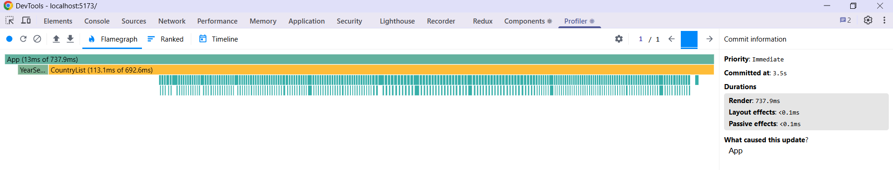
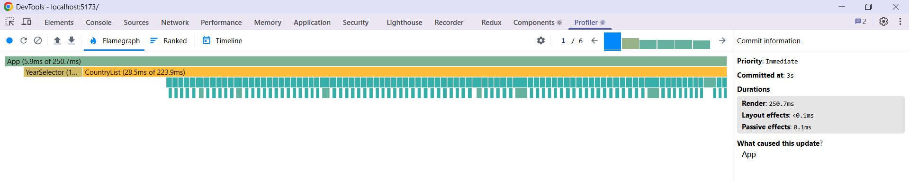
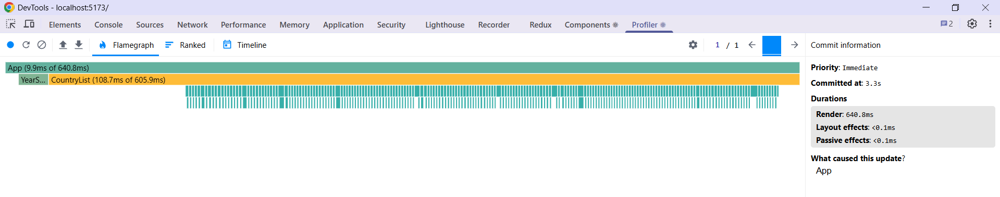
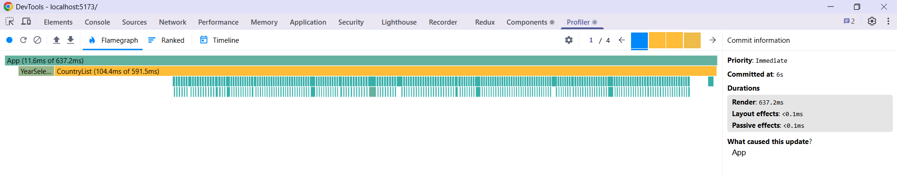

# Performance Optimization Report

## Baseline Measurements

### Interaction A: Sort countries

- **Commit duration**: 3.5 s
- **Render duration**: 737.9 ms
- **Screenshot**: 

### Interaction B: Search countries

- **Commit duration**: 3 s
- **Render duration**: 250.7 ms
- **Screenshot**: 

### Interaction C: Change year

- **Commit duration**: 3.3 s
- **Render duration**: 640.8 ms
- **Screenshot**: 

### Interaction D: Toggle column

- **Commit duration**: 6 s
- **Render duration**: 637.2 ms
- **Screenshot**: 