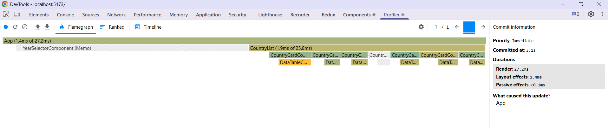
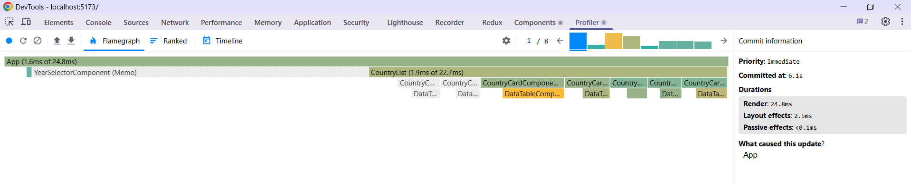
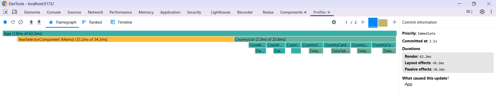
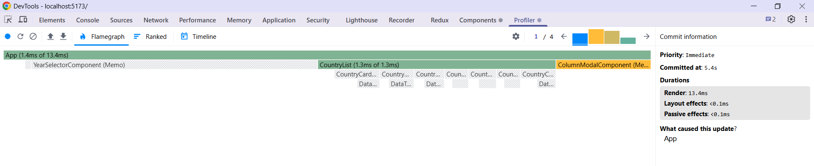

# Performance Optimization Report

## Baseline Measurements

### Interaction A: Sort countries

- **Commit duration**: 3.5 s
- **Render duration**: 737.9 ms
- **Screenshot**: 

### Interaction B: Search countries

- **Commit duration**: 3 s
- **Render duration**: 250.7 ms
- **Screenshot**: 

### Interaction C: Change year

- **Commit duration**: 3.3 s
- **Render duration**: 640.8 ms
- **Screenshot**: 

### Interaction D: Toggle column

- **Commit duration**: 6 s
- **Render duration**: 637.2 ms
- **Screenshot**: 

## Optimized Measurements

### Interaction A: Sort countries

- **Commit duration**: 3.1 s
- **Render duration**: 27.2 ms
- **Screenshot**: 

### Interaction B: Search countries

- **Commit duration**: 6.1 s
- **Render duration**: 24.8 ms
- **Screenshot**: 

### Interaction C: Change year

- **Commit duration**: 2.5 s
- **Render duration**: 62.2 ms
- **Screenshot**: 

### Interaction D: Toggle column

- **Commit duration**: 5.4 s
- **Render duration**: 13.4 ms
- **Screenshot**: 

## Summary of Improvements

| Interaction      | Baseline (ms)    | Optimized (ms) | Improvement |
| ---------------- | -------------    | -------------- | ----------- |
| Sort countries   | 737.9            | 27.2           | 96.3%       |
| Search countries | 250.7            | 24.8           | 90.1%       |
| Change year      | 640.8            | 62.2           | 90.29%      |
| Toggle column    | 637.2            | 13.4           | 99.02%      |
| **Average**      | **566.65**       | **31.9**       | **94.37%**  |